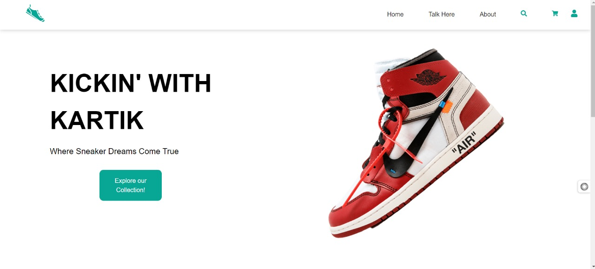
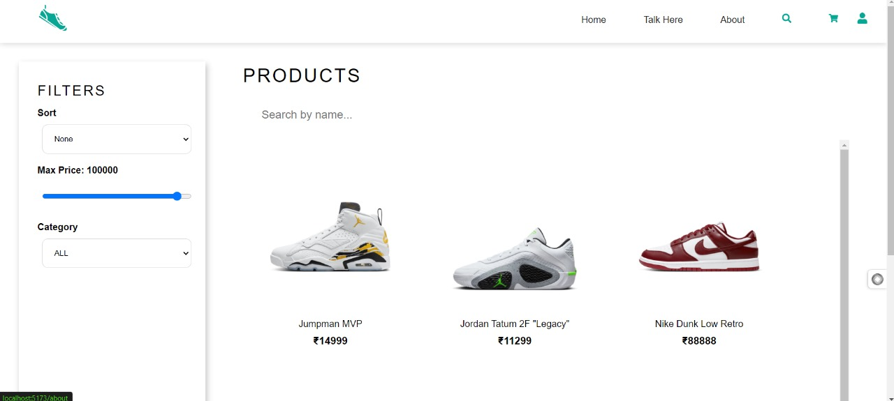

# UrbanKart-Backend

**UrbanKart** is a full-stack e-commerce platform offering a seamless shopping experience. The backend is designed to handle business logic, payment processing, and data storage, while the frontend provides an interactive and user-friendly interface.

---

## 🛠️ Technologies Used

### Backend:

- **Node.js** - JavaScript runtime for backend services
- **Express** - Fast and minimal web framework for Node.js
- **MongoDB** - NoSQL database for backend data management
- **Stripe** - Payment gateway for secure transactions
- **Multer** - Middleware for handling file uploads
- **TypeScript** - Typed JavaScript for better scalability and maintainability

---

## 📚 Features

- **Authentication**: Secure JWT-based user authentication.
- **Product Management**: CRUD operations for managing products.
- **Shopping Cart**: Add items, remove items, and calculate total cost dynamically.
- **Order Management**: Manage and track customer orders.
- **Payment Integration**: Seamless payment processing using **Stripe**.
- **File Uploads**: Handle image and file uploads with **Multer**.
- **API Integration**: **RTK Query** for efficient API interaction in the frontend.
- **Type Safety**: **TypeScript** used across the stack for safe, maintainable code.

---




## 🚀 Getting Started

### 1. Clone the repository:

```bash
git clone https://github.com/RKartik9/SneakersHub---Backend/
```

### 2. Install dependencies:

Navigate to the project directory and run:

```bash
npm install
```

### 3. Run the backend server:

```bash
npm start
```

The backend will be running at `http://localhost:5000`.

---

## 💳 Stripe Integration

**Stripe** is integrated into the backend for handling payments securely, ensuring a smooth and trustworthy checkout experience for users.

---

## 🖌️ UI Design

The frontend design is crafted using **Figma** to provide an intuitive and visually engaging user experience. It is aligned with modern design principles to ensure seamless interaction with the backend services.

---

## 🛠️ Tools

- **Postman** - API testing and development tool
- **Multer** - Middleware for file handling in Node.js
- **Redux Toolkit & RTK Query** - State management and API handling in the frontend

---
